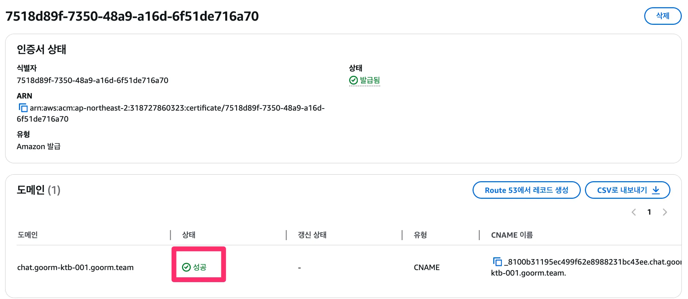
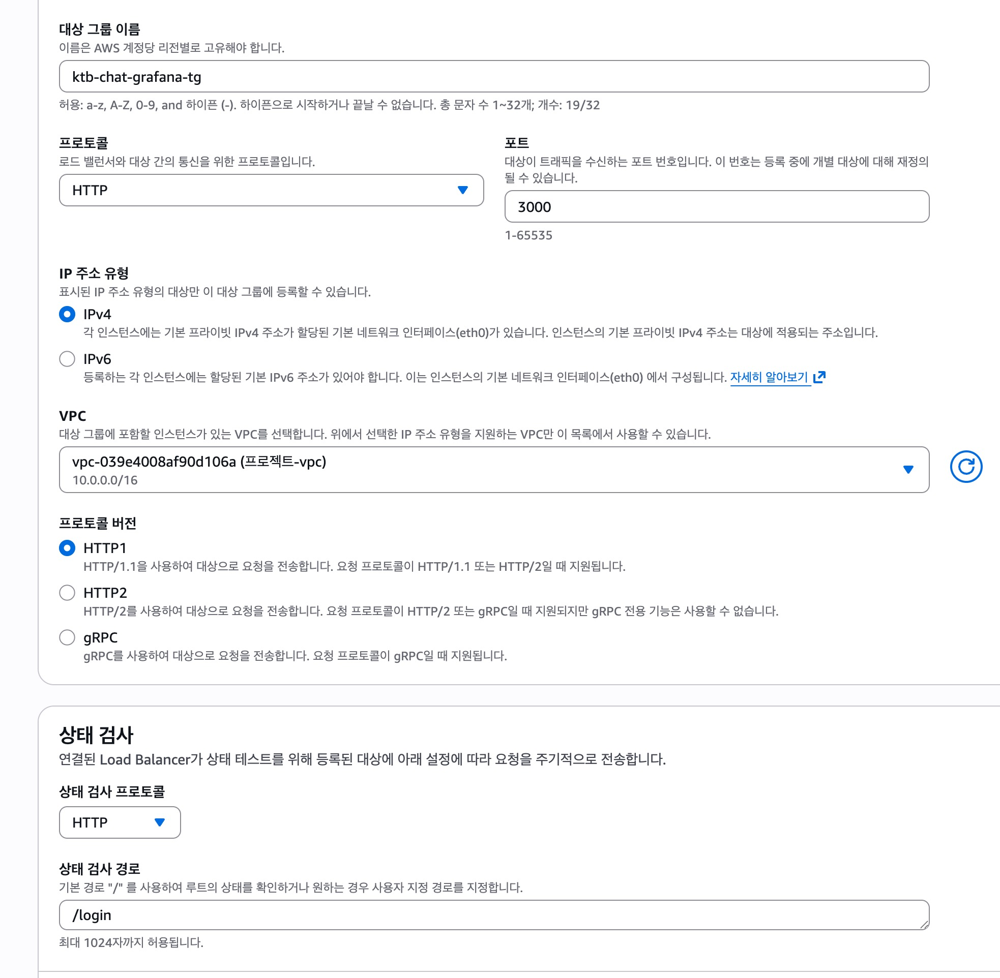
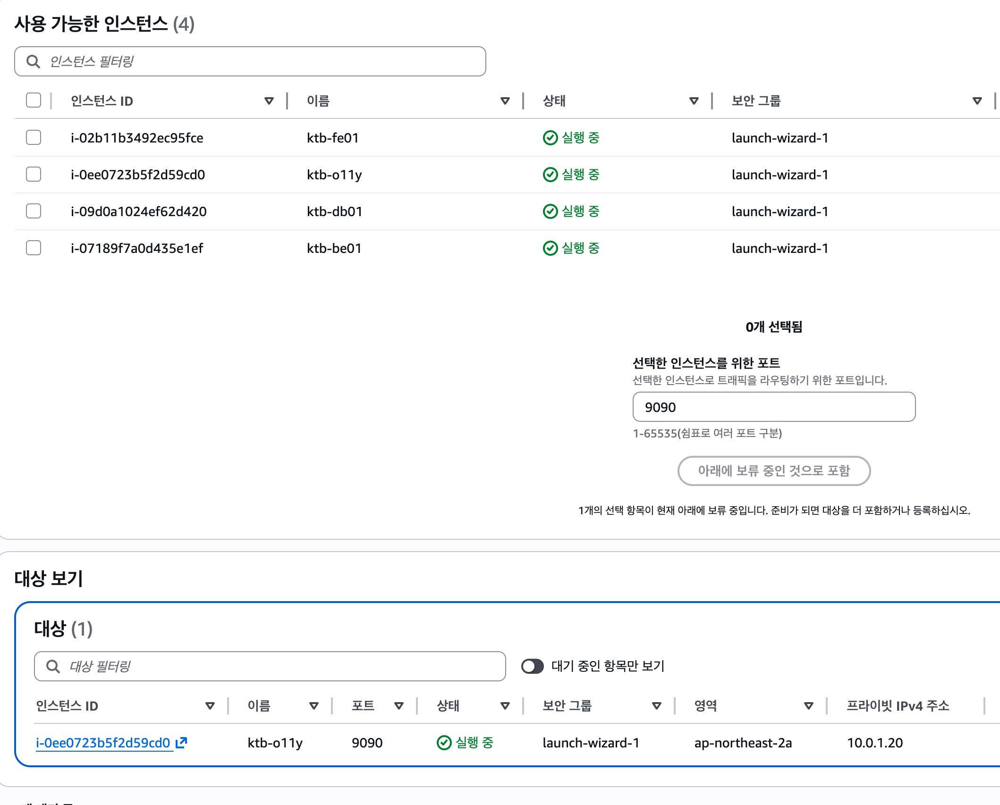
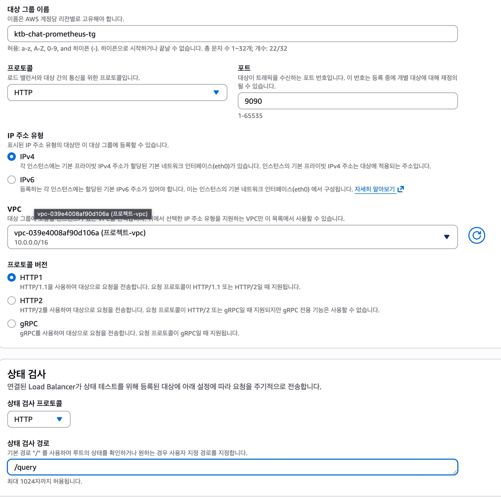
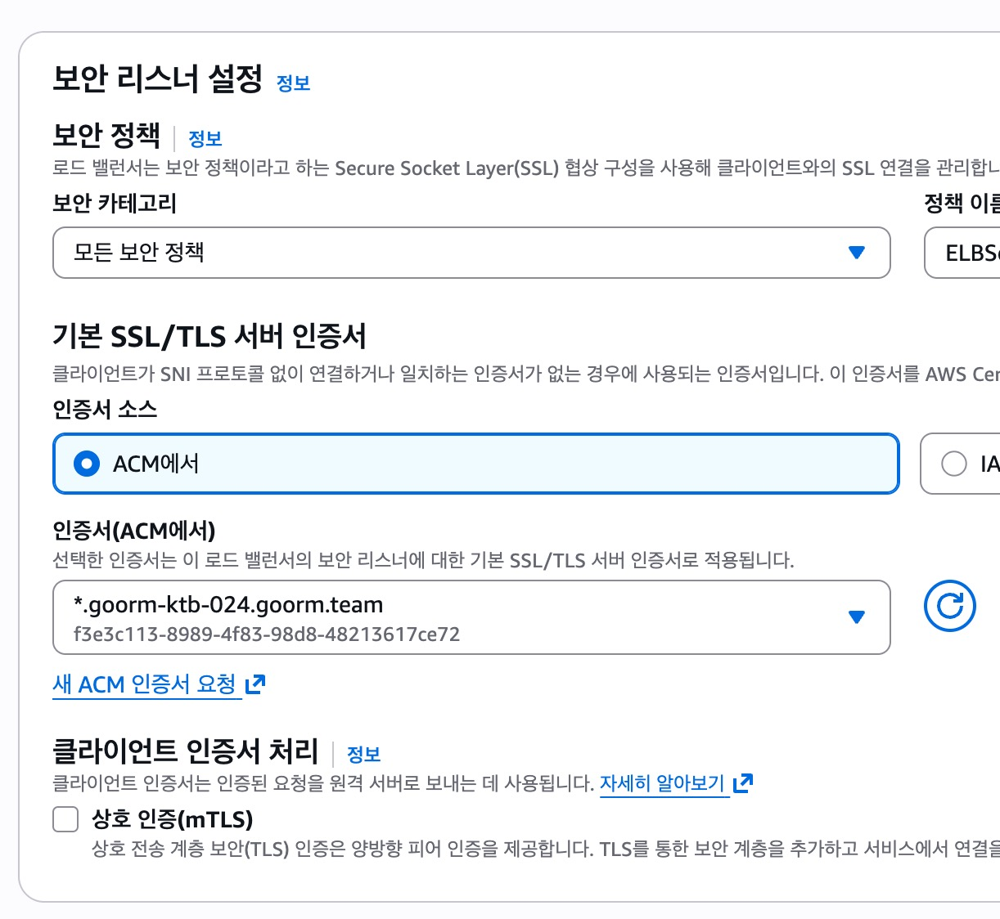
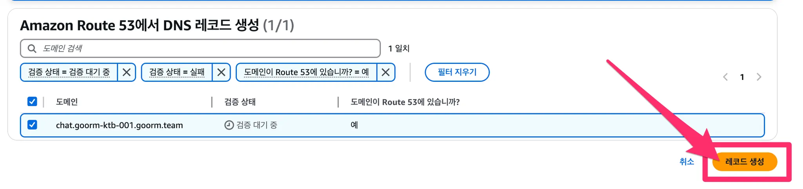
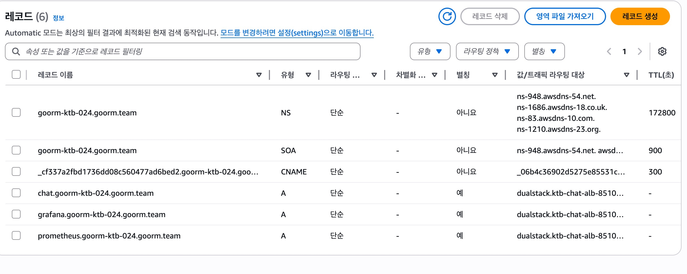

# Grafana & Prometheus AWS 접속 설정 가이드

이 문서는 AWS 환경에서 Grafana와 Prometheus에 접속하기 위한 설정 가이드입니다.

이 문서를 읽기 전에 [[AWS] 기본 사용자 가이드](https://goorm.notion.site/AWS-1564e6997fb0800ca01bfb7f3e98281e?v=2e8e1d86191c416aa3b14d148168bf19) 를 먼저 숙지해 주세요. 

## 목차

1. [개요](#개요)
2. [사전 요구사항](#사전-요구사항)
3. [인증서 생성](#인증서-생성)
4. [대상 그룹 생성](#대상-그룹-생성)
5. [로드 밸런서 리스너 설정](#로드-밸런서-리스너-설정)
6. [Route 53 레코드 추가](#route-53-레코드-추가)
7. [검증](#검증)

---

## 개요

### 아키텍처

```
Route 53 (DNS)
    ↓
Application Load Balancer (HTTPS:443)
    ├── Grafana Target Group (HTTP:3000)
    │   └── EC2 Instance (ktb-o11y)
    └── Prometheus Target Group (HTTP:9090)
        └── EC2 Instance (ktb-o11y)
```

### 설정 정보

- **도메인**: goorm-ktb-024.goorm.team (goorm-ktb-024 는 AWS 계정이름 입니다.)
- **VPC**: vpc-039e4008af90d106a (프로젝트-vpc)
- **서브도메인**:
  - Grafana: `grafana.goorm-ktb-024.goorm.team`
  - Prometheus: `prometheus.goorm-ktb-024.goorm.team`
- **인스턴스**: ktb-o11y (i-0ee0723b5f2d59cd0)

---

## 사전 요구사항

- AWS 계정 및 적절한 권한
- Route 53에 등록된 도메인 (goorm-ktb-024.goorm.team)
- VPC 및 서브넷 구성 완료
- Grafana와 Prometheus가 실행 중인 EC2 인스턴스

---

## 인증서 생성

### AWS Certificate Manager에서 퍼블릭 인증서 요청

1. **AWS Console** → **Certificate Manager** 이동
2. **인증서 요청** 클릭
3. 퍼블릭 인증서 요청 선택

#### 도메인 이름 설정

- **완전히 정규화된 도메인 이름**: `*.goorm-ktb-024.goorm.team`
  - 와일드카드 인증서로 모든 서브도메인 지원
  - 예: grafana, prometheus, chat 등


#### 검증 방법

- DNS 검증 또는 이메일 검증 선택
- Route 53을 사용하는 경우 DNS 검증 권장

#### 인증서 상태 확인

- 인증서 ID 예시: `f3e3c113-8989-4f83-98d8-48213617ce72`
- 상태가 **발급됨**으로 변경될 때까지 대기



---

## 대상 그룹 생성

### 1. Grafana 대상 그룹

#### 기본 구성

```yaml
대상 그룹 이름: ktb-chat-grafana-tg
프로토콜: HTTP
포트: 3000
IP 주소 유형: IPv4
VPC: vpc-039e4008af90d106a (프로젝트-vpc)
프로토콜 버전: HTTP1
```

#### 상태 검사 설정

```yaml
프로토콜: HTTP
경로: /login
포트: 트래픽 포트
정상 임계값: 2
비정상 임계값: 2
제한 시간: 5초
간격: 30초
```



#### 대상 등록

1. **사용 가능한 인스턴스** 섹션에서 선택
2. **인스턴스**: ktb-o11y (i-0ee0723b5f2d59cd0)
3. **포트**: 3000
4. **아래에 보류 중인 것으로 포함** 클릭



### 2. Prometheus 대상 그룹

#### 기본 구성

```yaml
대상 그룹 이름: ktb-chat-prometheus-tg
프로토콜: HTTP
포트: 9090
IP 주소 유형: IPv4
VPC: vpc-039e4008af90d106a (프로젝트-vpc)
프로토콜 버전: HTTP1
```

#### 상태 검사 설정

```yaml
프로토콜: HTTP
경로: /query
포트: 트래픽 포트
정상 임계값: 2
비정상 임계값: 2
제한 시간: 5초
간격: 30초
```



#### 대상 등록

1. **인스턴스**: ktb-o11y (i-0ee0723b5f2d59cd0)
2. **포트**: 9090
3. **아래에 보류 중인 것으로 포함** 클릭

---

## 로드 밸런서 리스너 설정

### HTTPS 리스너 생성 (포트 443)

#### 보안 리스너 설정

```yaml
프로토콜: HTTPS
포트: 443
보안 정책: ELBSecurityPolicy-2016-08 (또는 최신 정책)
```

#### 인증서 설정

```yaml
인증서 소스: ACM에서
인증서: *.goorm-ktb-024.goorm.team
인증서 ID: f3e3c113-8989-4f83-98d8-48213617ce72
```



#### 클라이언트 인증서 처리

- **상호 인증(mTLS)**: 선택 사항
  - TLS를 통한 보안 계층 추가 시 활성화

### 리스너 규칙 설정

총 5개의 규칙 구성 (우선순위 순서 중요):

#### 규칙 5: Grafana/Prometheus 라우팅

Grafana/Prometheus 가 `/api` path 를 사용하고 있어 우선순위를 높게 조정하였습니다.

```yaml
우선 순위: 5
조건: 호스트 헤더 (값) = grafana.goorm-ktb-024.goorm.team
작업: 전달 대상 → ktb-chat-grafana-tg (포트 3000)
```

```yaml
우선 순위: 6
조건: 호스트 헤더 (값) = prometheus.goorm-ktb-024.goorm.team
작업: 전달 대상 → ktb-chat-grafana-tg (포트 9090)
```

#### 규칙 10: API 경로

```yaml
우선 순위: 10
조건: 경로 (값) = /api/*
작업: 전달 대상 → 적절한 대상 그룹
```

#### 규칙 20: WebSocket 경로

```yaml
우선 순위: 20
조건: 경로 (값) = /socket.io/*
작업: 전달 대상 → 적절한 대상 그룹
```

#### 마지막 규칙 (기본값)

```yaml
우선 순위: 마지막
조건: 다른 규칙이 적용되지 않는 경우
작업: 기본 작업 수행
```


---

## Route 53 레코드 추가

### DNS 레코드 구성

Route 53 호스팅 영역에 다음 레코드 생성:



#### 1. Grafana A 레코드

```yaml
레코드 이름: grafana.goorm-ktb-024.goorm.team
레코드 타입: A
별칭: 예
트래픽 라우팅 대상: Application/Classic Load Balancer 별칭
    - 리전: ap-northeast-2
    - 로드 밸런서: dualstack.ktb-chat-alb-8510...
라우팅 정책: 단순
```

#### 2. Prometheus A 레코드

```yaml
레코드 이름: prometheus.goorm-ktb-024.goorm.team
레코드 타입: A
별칭: 예
트래픽 라우팅 대상: Application/Classic Load Balancer 별칭
    - 리전: ap-northeast-2
    - 로드 밸런서: dualstack.ktb-chat-alb-8510...
라우팅 정책: 단순
```

#### 3. 기타 레코드 (참고)

```yaml
# Chat 서비스
레코드 이름: chat.goorm-ktb-024.goorm.team
레코드 타입: A
별칭: 동일한 로드 밸런서
```



### NS 및 SOA 레코드

자동으로 생성된 레코드 확인:

```yaml
# NS 레코드
goorm-ktb-024.goorm.team
    - ns-948.awsdns-54.net
    - ns-1686.awsdns-18.co.uk
    - ns-83.awsdns-10.com
    - ns-1210.awsdns-23.org
TTL: 172800초

# SOA 레코드
goorm-ktb-024.goorm.team
TTL: 900초
```

---

## 검증

### 1. 인증서 검증

```bash
# OpenSSL로 인증서 확인
openssl s_client -connect grafana.goorm-ktb-024.goorm.team:443 -servername grafana.goorm-ktb-024.goorm.team

# 인증서 정보 확인
echo | openssl s_client -connect grafana.goorm-ktb-024.goorm.team:443 2>/dev/null | openssl x509 -noout -subject -issuer -dates
```

### 2. DNS 전파 확인

```bash
# DNS 조회
nslookup grafana.goorm-ktb-024.goorm.team
nslookup prometheus.goorm-ktb-024.goorm.team

# 또는 dig 사용
dig grafana.goorm-ktb-024.goorm.team
dig prometheus.goorm-ktb-024.goorm.team
```

### 3. HTTPS 접속 테스트

```bash
# curl로 테스트
curl -I https://grafana.goorm-ktb-024.goorm.team
curl -I https://prometheus.goorm-ktb-024.goorm.team

# 웹 브라우저에서 접속
# https://grafana.goorm-ktb-024.goorm.team
# https://prometheus.goorm-ktb-024.goorm.team
```

### 4. 대상 그룹 상태 확인

AWS Console → EC2 → 대상 그룹:

- **ktb-chat-grafana-tg**: 상태가 **healthy**인지 확인
- **ktb-chat-prometheus-tg**: 상태가 **healthy**인지 확인

### 5. 로드 밸런서 메트릭 확인

CloudWatch에서 다음 메트릭 확인:

- HealthyHostCount
- UnHealthyHostCount
- TargetResponseTime
- RequestCount

---

## 트러블슈팅

### 인증서 오류

**문제**: 브라우저에서 인증서 경고 발생

**해결**:
- ACM에서 인증서 상태가 **발급됨**인지 확인
- 도메인 이름이 정확한지 확인
- 리스너에 올바른 인증서가 연결되었는지 확인

### 502 Bad Gateway

**문제**: ALB에서 502 오류 반환

**해결**:
- 대상 그룹의 상태 검사 확인
- EC2 인스턴스의 보안 그룹 규칙 확인
- Grafana/Prometheus 서비스 실행 상태 확인

```bash
# 인스턴스에 SSH 접속 후
sudo systemctl status grafana-server
sudo systemctl status prometheus

# 포트 리스닝 확인
sudo netstat -tlnp | grep 3000
sudo netstat -tlnp | grep 9090
```

### 503 Service Unavailable

**문제**: 서비스를 사용할 수 없음

**해결**:
- 대상 그룹에 healthy 대상이 있는지 확인
- 인스턴스가 실행 중인지 확인
- 상태 검사 경로가 올바른지 확인 (/login, /query)

### DNS 전파 지연

**문제**: 도메인 조회가 되지 않음

**해결**:
- DNS 전파는 최대 48시간 소요 (일반적으로 몇 분)
- TTL 값 확인
- 다른 DNS 서버로 조회 시도

```bash
# Google DNS로 조회
nslookup grafana.goorm-ktb-024.goorm.team 8.8.8.8
```

---

## 보안 고려사항

### 1. 보안 그룹 설정

#### ALB 보안 그룹

```yaml
인바운드 규칙:
  - 타입: HTTPS
    포트: 443
    소스: 0.0.0.0/0 (또는 특정 IP 범위)
```

#### EC2 인스턴스 보안 그룹

```yaml
인바운드 규칙:
  - 타입: Custom TCP
    포트: 3000
    소스: ALB 보안 그룹
  - 타입: Custom TCP
    포트: 9090
    소스: ALB 보안 그룹
```
